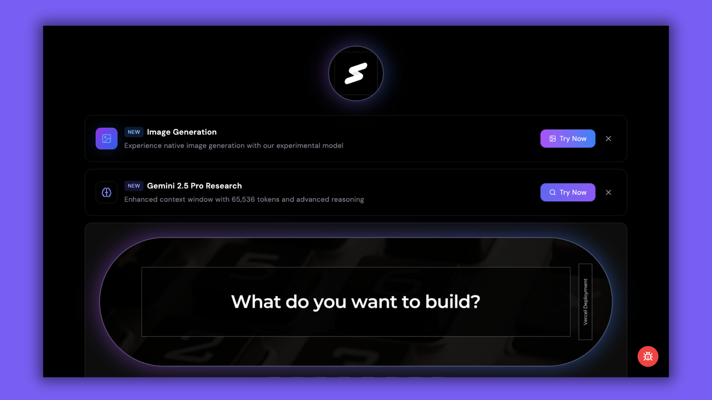

# Keynote Platform

A modern presentation and learning platform powered by Google Gemini AI.

[](https://keynote-niladridas-ecru.vercel.app)
[](https://www.typescriptlang.org/)
[](https://reactjs.org/)
[](LICENSE)



## Overview

This platform combines presentation capabilities with interactive learning features, leveraging Google's latest AI models. It offers a unique blend of presentation tools and educational resources, making it ideal for both creating engaging presentations and learning complex concepts.

## AI Integration

This platform legally integrates with Google's AI services:
- **Gemini 2.5 Pro** (model: `gemini-2.5-pro-exp-03-25`) for text generation and interactions
- **Gemini 2.0 Flash** (model: `gemini-2.0-flash-exp-image-generation`) for image generation

All AI features are implemented in full compliance with Google's terms of service and usage guidelines. We maintain complete transparency about the AI models used in this platform.

## Core Features

- **AI-Powered Content**: Dynamic content generation using Google Gemini 2.5 Pro
- **Image Generation**: AI-powered image creation using Gemini 2.0 Flash
- **Interactive Interface**: Seamless presentation and learning experience
- **Research Interface**: AI-assisted research and content exploration
- **Responsive Design**: Optimized for all device sizes
- **Mathematical Support**: KaTeX integration for mathematical formulas

## Legal Compliance

This platform:
- Uses official Google AI APIs with proper authentication
- Maintains transparency about AI capabilities and limitations
- Follows all terms of service and usage guidelines
- Requires proper API keys and authentication for AI features
- Does not make false claims about AI capabilities

## Technology Stack

### Frontend
- React 18.3
- TypeScript 5.5
- Tailwind CSS
- Framer Motion
- Google Gemini AI

### Key Libraries
- KaTeX for mathematical notation
- React Markdown for content rendering
- React Syntax Highlighter for code examples

## Getting Started

1. Clone the repository:
```bash
git clone https://github.com/bniladridas/keynote-niladridas.git
cd keynote-niladridas
```

2. Install dependencies:
```bash
npm install
```

3. Set up environment variables:
```bash
cp .env.example .env
# Add your Google Gemini AI API key to .env
```

4. Start development server:
```bash
npm run dev
```

## Available Scripts

- `npm run dev` - Development server
- `npm run build` - Production build
- `npm run lint` - Code linting
- `npm run test` - Run tests
- `npm run preview` - Preview build

## Project Architecture

```
src/
├── components/     # UI components
├── lib/           # Core utilities & AI integration
├── hooks/         # React hooks
├── styles/        # Global styles
└── types/         # TypeScript definitions
```

## Contributing

1. Fork the repository
2. Create your feature branch (`git checkout -b feature/Enhancement`)
3. Commit changes (`git commit -m 'Add: Enhancement'`)
4. Push to branch (`git push origin feature/Enhancement`)
5. Open a Pull Request

## How to Create a Pull Request

1. Ensure your fork is up to date with the main repository:
```bash
git remote add upstream https://github.com/bniladridas/keynote-niladridas.git
git fetch upstream
git checkout main
git merge upstream/main
```

2. Create and switch to your feature branch:
```bash
git checkout -b feature/YourFeatureName
```

3. Make your changes and stage them:
```bash
git add .
```

4. Commit your changes with a descriptive message:
```bash
git commit -m "feat: add your feature description"
```

5. Push your branch to your fork:
```bash
git push origin feature/YourFeatureName
```

6. Visit the original repository on GitHub and click "New Pull Request"
7. Select your branch from your fork and create the pull request with:
   - A clear title
   - Detailed description of changes
   - Any relevant issue numbers

## Author

Niladri Das
- GitHub: [@bniladridas](https://github.com/bniladridas)
- Twitter: [@bniladridas](https://twitter.com/bniladridas)
- LinkedIn: [Connect](https://linkedin.com/in/bniladridas)

## License

MIT License - see [LICENSE](LICENSE) for details.
